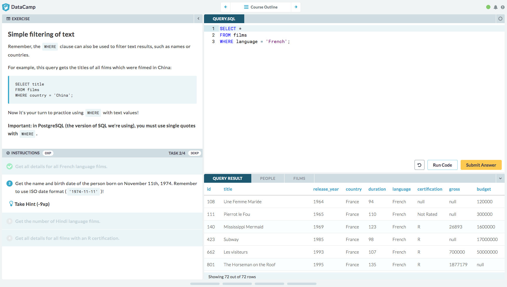
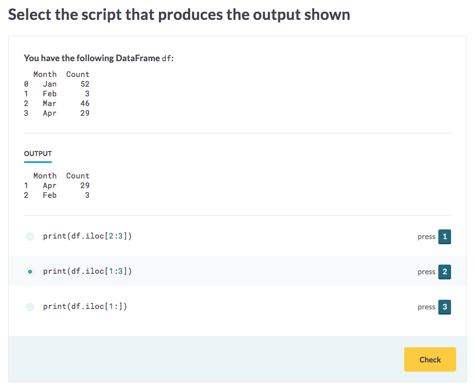
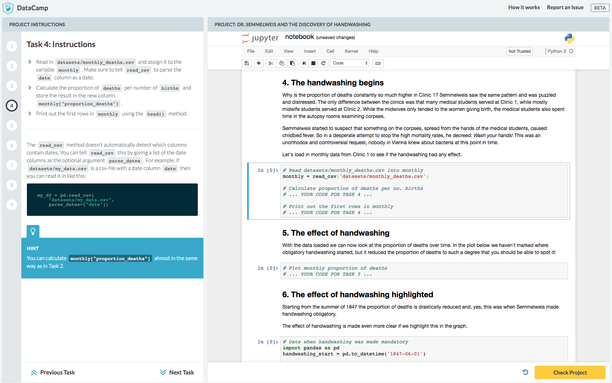

# Welcome!

This documentation is the single source of truth for all things related to creating educational content on the DataCamp platform. Anyone can create content for free using our authoring tools, then make that content available to others.

If you'd like to make your content freely available to the general public via the [Community section](https://www.datacamp.com/community/) of our website, you can get started on your content right away and reach out to [support@datacamp.com](mailto:support@datacamp.com) when it's done. If you're interested in creating premium content on [datacamp.com](https://www.datacamp.com/) available only to DataCamp subscribers, you can [apply here](https://www.datacamp.com/create/) to be considered. If selected to create premium content, we will work closely with you to plan and develop the material so that it fits neatly among our other premium offerings.

# Types of content

DataCamp supports several different types of educational content, each serving a particular purpose: 

* **Courses** teach new data science material
* **Challenges** allow students to practice what they've learned in courses
* **Projects** provide an opportunity to apply things in a real-world setting

### Courses

The purpose of a DataCamp course is to teach students something new. For example, our [Introduction to SQL for Data Science](https://www.datacamp.com/courses/intro-to-sql-for-data-science) course teaches students the basics of using SQL in a data science context, covering basic `SELECT` statements, filtering, aggregate functions, etc.

Ready to create a course? **[Get started now!](courses/README.md)**

### Challenges

Challenges give students a chance to practice what they've learned in courses. For example, our [pandas Foundations](https://challenges.datacamp.com/practice/300) challenges test students' ability to perform basic tasks with the popular Python package introduced in [our course](https://www.datacamp.com/courses/pandas-foundations) by the same name.

<!-- Ready to create some challenges? **[Get started now!](challenges/README.md)** -->

> #### info::Note
> Challenge authoring is only available to invited instructors at the moment, but should be available to everyone in the near future. **If you're interested in creating a project, please contact [spencer@datacamp.com](mailto:spencer@datacamp.com) for more info!**
> 
> In the meantime, you can browse the relevant [documentation](challenges/README.md).

### Projects

Projects allow students to apply what they've learned in a more open-ended and real world data science context. For example, our [Dr. Semmelweis and the discovery of handwashing](https://www.datacamp.com/projects/20) project allows students to analyze data on the life-saving impact of the discovery of handwashing in the 1800s.

<!-- Ready to create a project? **[Get started now!](projects/README.md)** -->

> #### info::Note
> Project authoring is only available to invited instructors at the moment, but should be available to everyone in the near future. **If you're interested in creating a project, please contact [rasmus@datacamp.com](mailto:rasmus@datacamp.com) for more info!**
>
> In the meantime, you can browse the relevant [documentation](projects/README.md).
