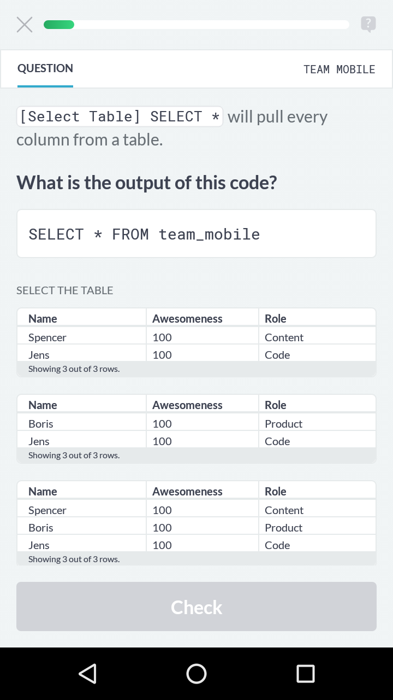

# Select Table

A Select Table exercise is essentially identical to a [Select Output
exercise](select-output.md), but instead of a choosing the correct `output`
block, students are asked to choose the correct `table` block. This is ideal for
exercises when the output of a code block is better represented as a table - SQL
queries, for example.

```yaml
# SELECT *
- key: # generate me!
  tabs:
    - key: team_mobile
      type: table
  context: "`SELECT *` will pull every column from a table."
  code: "SELECT * FROM team_mobile"
  table:
    data: |-
      Name   ,Awesomeness,Role
      Spencer,100        ,Content
      Boris  ,100        ,Product
      Jens   ,100        ,Code
    message: "Showing 3 out of 3 rows."
  distractor_table:
    - option:
        data: |-
          Name   ,Awesomeness,Role
          Spencer,0          ,Content
          Boris  ,100        ,Product
          Jens   ,100        ,Code
        message: "Showing 3 out of 3 rows."
      feedback: "Spencer is also awesome."
    - option: |-
        Name   ,Awesomeness,Role
        Spencer,100        ,Content
        Boris  ,0          ,Product
        Jens   ,100        ,Code
      feedback: "Boris is also awesome."
```



The `option`s in the `distractor_table` block have a structure identical to that
of a `table` block (because they are also tables). Refer to the [documentation
for `table` blocks](README.md/#table) for more information.
