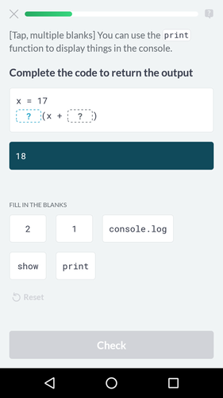

# Tap

Tap exercises are similar to a [Select Code](select-code.md) exercise, in that
student's are asked to produce the code that generates a given output. In a Tap
exercise, however, the framework for the code block is provided with 1 or more
blanks, and students only need to fill in the blanks from a set of
possibilities.

In order to specify the location of blanks, Tap exercises require a special
`code` block - it must include at least one `??` placeholder. Each `??`
corresponds to the location of a fill-in-the-blank in the rendered exercise.

They also require a special additional field `blanks`. The `blanks` field
specifies the correct sequence of blanks (in the correct order), while the
`distractor_blanks` field specifies the additional distractor items that will be
available.

The default `question` block for a Tap exercise is `Complete the code to
generate the output`.

```yaml
# print()
- key: # generate me!
  context: "You can use the `print` function to display things in the console."
  code: |-
    x = 17
    ??(x)
  output: "17"
  blanks:
    - "print"
  distractor_blanks:
    - option: "show"
      feedback: ""
    - option: "console.log"
      feedback: "That's how it works in JavaScript, not Python."
```


If there is more than one blank, customized feedback for individual distractors
is not supported. You can (and should!) still use a fallback `feedback_wrong`
field, however.

```yaml
# print()
- key: # generate me!
  context: "You can use the `print` function to display things in the console."
  code: |-
    x = 17
    ??(x + ??)
  output: "18"
  blanks:
    - "print"
    - "1"
  distractor_blanks:
    - "show"
    - "console.log"
    - "2"
  feedback_wrong: "We want to `print` the results of an expression that adds up to `18`."
```


