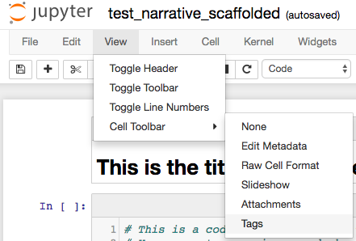

The format of a DataCamp Project notebook
=========================================

In a live DataCamp Project the student is working in a Jupyter notebook (the *Student notebook*), but the whole Projects is also authored as a Jupyter notebook: The *Project notebook*. The reason for using a Jupyter notebook as the authoring format is that the project can be developed locally, but still will have a similar appearance to the final live project. 

To be used to build a final live project, a Project notebook needs to follow a certain format. It is that format that is descibed here.

| **Key**      | **Description**                            | **Display** | **Category** |
|--------------|--------------------------------------------|-------------|--------------|
| context      | Narrative for the task                     | Notebook    | Narrative    |
| solution     | Solution code to solve the task            |             | Narrative    |
| instructions | Detailed instructions to complete the task | Sidebar     | Pedagogy     |
| sample\_code | Minimal scaffolding code                   | Notebook    | Pedagogy     |
| hint         | Help for the user when they get stuck      | Sidebar     | Pedagogy     |
| tests        | Check if the user has completed the task   | Sidebar     | Pedagogy     |